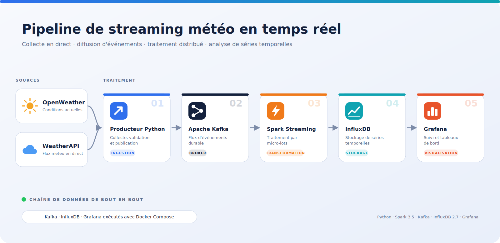

# Pipeline de streaming météo en temps réel

Projet de **data engineering** qui compare en direct deux sources météo : les mesures d'**OpenWeather** et de **WeatherAPI** sont collectées, diffusées dans **Apache Kafka**, traitées par **Spark Structured Streaming**, stockées dans **InfluxDB**, puis affichées dans **Grafana**.



---

## Sommaire

- [Objectif](#objectif)
- [Organisation du dépôt](#organisation-du-dépôt)
- [Fonctionnement](#fonctionnement)
- [Format des données](#format-des-données)
- [Prérequis](#prérequis)
- [Installation et lancement](#installation-et-lancement)
- [Configuration](#configuration)
- [Services et ports](#services-et-ports)
- [Tableaux de bord Grafana](#tableaux-de-bord-grafana)
- [Sécurité](#sécurité)
- [Limites et améliorations](#limites-et-améliorations)

---

## Objectif

Deux services météo donnent rarement exactement la même température au même moment. Ce projet met en place une chaîne complète, de la collecte jusqu'au tableau de bord, pour **observer l'écart entre les deux fournisseurs en continu** et conserver l'historique des mesures.

Il illustre les briques classiques d'une architecture de streaming : ingestion, bus de messages, traitement par micro-lots, base de séries temporelles et visualisation.

## Organisation du dépôt

```
weather-streaming-pipeline/
├── producer/
│   └── weather_producer.py     # Collecte des API et publication dans Kafka
├── consumer/
│   └── spark_consumer.py       # Lecture Kafka, traitement Spark, écriture InfluxDB
├── scripts/
│   ├── create_topic.ps1        # Création du topic (Windows)
│   └── create_topic.sh         # Création du topic (macOS / Linux)
├── docs/
│   └── screenshots/            # Schéma du pipeline
├── docker-compose.yml          # Zookeeper, Kafka, InfluxDB, Grafana
├── requirements.txt
├── .env.example
├── .gitignore
└── README.md
```

## Fonctionnement

| Étape | Outil | Rôle |
|---|---|---|
| 1. Ingestion | Producteur Python | Interroge les deux API toutes les 30 secondes (valeur par défaut), vérifie les réponses et publie un événement JSON |
| 2. Transport | Apache Kafka | Conserve les événements dans le topic `weather-data` |
| 3. Traitement | Spark Structured Streaming | Lit le topic, applique un schéma, écarte les messages sans ville et traite les données par micro-lots |
| 4. Stockage | InfluxDB 2.7 | Enregistre chaque mesure comme un point de série temporelle |
| 5. Visualisation | Grafana | Affiche les courbes et les comparaisons |

## Format des données

**Événement publié dans Kafka**

```json
{
  "city": "Tetouan",
  "openweather_temperature": 21.4,
  "openweather_humidity": 63.0,
  "weatherapi_temperature": 22.0,
  "weatherapi_humidity": 60.0,
  "timestamp": 1767000000
}
```

Les températures sont en degrés Celsius, l'humidité en pourcentage, et `timestamp` en secondes (heure Unix).

**Point enregistré dans InfluxDB**

| Élément | Contenu |
|---|---|
| Mesure (*measurement*) | `weather` |
| Étiquette (*tag*) | `city` |
| Champs (*fields*) | `openweather_temperature`, `openweather_humidity`, `weatherapi_temperature`, `weatherapi_humidity` |
| Horodatage | `timestamp` (précision : seconde) |

## Prérequis

- **Python 3.11**
- **Java 17** (nécessaire à Spark)
- **Docker** avec Docker Compose
- Une clé d'API [OpenWeather](https://openweathermap.org/api) et une clé d'API [WeatherAPI](https://www.weatherapi.com/)

## Installation et lancement

### 1. Récupérer le projet

```bash
git clone https://github.com/VOTRE_PSEUDO/weather-streaming-pipeline.git
cd weather-streaming-pipeline
```

### 2. Créer le fichier de configuration

```bash
# Windows (PowerShell)
Copy-Item .env.example .env

# macOS / Linux
cp .env.example .env
```

Ouvrez `.env` et remplacez toutes les valeurs d'exemple (clés d'API, mots de passe, jeton InfluxDB).

### 3. Démarrer l'infrastructure

```bash
docker compose up -d
docker compose ps
```

Attendez que Kafka, InfluxDB et Grafana soient démarrés.

### 4. Créer le topic Kafka

```bash
# Windows (PowerShell)
.\scripts\create_topic.ps1

# macOS / Linux
bash scripts/create_topic.sh
```

> Les scripts créent le topic `weather-data`. Si vous modifiez `KAFKA_TOPIC` dans `.env`, adaptez aussi le nom dans ces scripts.

### 5. Préparer l'environnement Python

```bash
conda create -n weather_streaming python=3.11 -y
conda activate weather_streaming
pip install -r requirements.txt
```

Sans conda : `python -m venv .venv`, activez-le, puis `pip install -r requirements.txt`.

### 6. Lancer le producteur

```bash
python producer/weather_producer.py
```

### 7. Lancer le consommateur Spark

Dans un second terminal, depuis le dossier du projet :

```bash
conda activate weather_streaming

spark-submit \
  --packages org.apache.spark:spark-sql-kafka-0-10_2.12:3.5.1 \
  consumer/spark_consumer.py
```

Sous PowerShell, remplacez le `\` de fin de ligne par un accent grave `` ` ``, ou écrivez la commande sur une seule ligne.

Le connecteur Kafka doit correspondre à la version de Spark installée (ici 3.5.1, comme `pyspark==3.5.1`).

> Spark démarre à partir des **derniers** messages (`startingOffsets = latest`) : lancez le producteur avant ou pendant le consommateur pour voir arriver des données.

### 8. Arrêter le projet

```bash
# Ctrl+C dans chaque terminal (producteur et Spark), puis :
docker compose down
```

Ajoutez `-v` à `docker compose down` pour supprimer aussi les données d'InfluxDB et de Grafana.

## Configuration

Toutes les variables sont dans le fichier `.env` (modèle : `.env.example`).

| Variable | Rôle | Valeur d'exemple |
|---|---|---|
| `OPENWEATHER_API_KEY` | Clé OpenWeather | à renseigner |
| `WEATHERAPI_API_KEY` | Clé WeatherAPI | à renseigner |
| `WEATHER_CITY` | Ville suivie | `Tetouan` |
| `FETCH_INTERVAL_SECONDS` | Délai entre deux collectes | `30` |
| `KAFKA_BOOTSTRAP_SERVERS` | Adresse de Kafka | `localhost:9092` |
| `KAFKA_TOPIC` | Nom du topic | `weather-data` |
| `INFLUXDB_URL` | Adresse d'InfluxDB | `http://localhost:8086` |
| `INFLUXDB_ORG` / `INFLUXDB_BUCKET` | Organisation et bucket | `weather-org` / `weather-data` |
| `INFLUXDB_TOKEN` | Jeton d'accès InfluxDB | à choisir (long et aléatoire) |
| `INFLUXDB_USERNAME` / `INFLUXDB_PASSWORD` | Compte administrateur InfluxDB | à choisir |
| `GRAFANA_ADMIN_USER` / `GRAFANA_ADMIN_PASSWORD` | Compte administrateur Grafana | à choisir |

## Services et ports

| Service | Adresse |
|---|---|
| Kafka | `localhost:9092` |
| InfluxDB | http://localhost:8086 |
| Grafana | http://localhost:3000 |

## Tableaux de bord Grafana

1. Ouvrez http://localhost:3000 et connectez-vous avec le compte défini dans `.env`.
2. Ajoutez une source de données **InfluxDB** (langage de requête : Flux) avec l'URL, l'organisation, le bucket et le jeton de votre `.env`. Depuis le conteneur Grafana, l'adresse à utiliser est `http://influxdb:8086`.
3. Créez vos panneaux. **Les tableaux de bord ne sont pas fournis dans le dépôt** : ils se construisent à la main dans Grafana. Exemples utiles :
   - température OpenWeather et température WeatherAPI sur le même graphique
   - écart de température entre les deux fournisseurs
   - comparaison de l'humidité
   - historique par ville

## Sécurité

- Les clés d'API et les mots de passe sont lus depuis `.env`, qui est exclu de Git par le `.gitignore`. Seul `.env.example`, avec des valeurs factices, est publié.
- Ne publiez jamais votre `.env`. Si une clé a été exposée par erreur, révoquez-la et générez-en une nouvelle.

## Limites et améliorations

- Une seule ville est suivie à la fois.
- Kafka et Spark ne sont pas conteneurisés : Spark se lance en local avec `spark-submit`.
- Le pipeline n'a pas de tests automatisés.

Pistes d'évolution :

- suivre plusieurs villes en parallèle
- provisionner automatiquement les tableaux de bord Grafana
- déclencher une alerte quand l'écart entre les deux fournisseurs dépasse un seuil
- ajouter des tests unitaires et d'intégration
- conteneuriser le producteur et le consommateur Spark
- valider le projet avec GitHub Actions

## Auteur

Projet réalisé par : *(à compléter : noms de l'équipe)*
